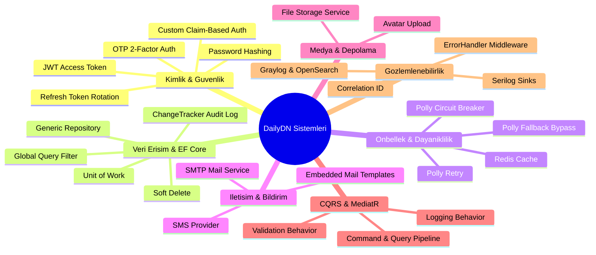
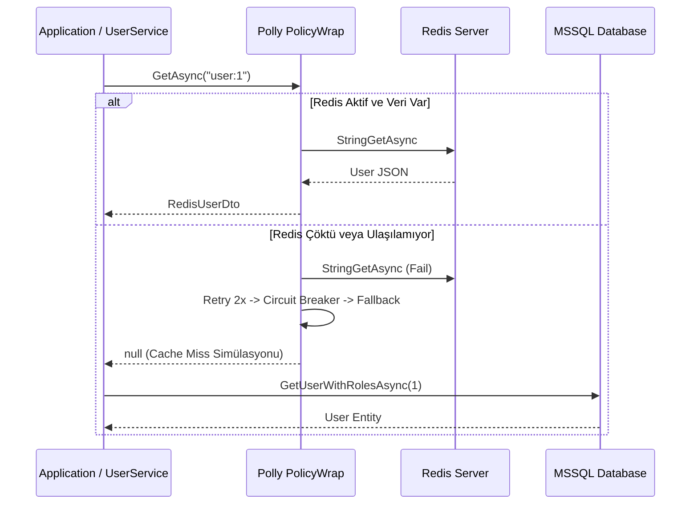

# 02. Sistemler, Bileşenler ve Amaçları (Systems & Components) ⚙️

DailyDN projesinde yer alan her bir alt sistem, kurumsal ölçekte güvenlik, performans, dayanıklılık ve genişletilebilirlik sağlamak amacıyla tasarlanmıştır.

Bu dokümanda sistemlerin **nerede konumlandığı**, **hangi amaca hizmet ettiği**, **nasıl çalıştığı** ve **hangi bileşenlerden oluştuğu** detaylandırılmıştır.

---

## 📑 Sistemler Haritası

---

## 1. 🛡️ Kimlik Doğrulama ve Yetkilendirme Sistemi (Authentication & Authorization)

- **Konum:**
  - `DailyDN.Infrastructure/Services/Impl/TokenService.cs`
  - `DailyDN.Application/Services/Implementations/AuthService.cs`
  - `DailyDN.Application/Common/Attributes/AuthorizedAttribute.cs`
  - `DailyDN.API/Middleware/AuthenticatedUserMiddleware.cs`
- **Amacı & Hizmet Ettiği Alan:**
  - Kullanıcıların güvenli bir şekilde sisteme kaydolmasını (`Register`), e-posta doğrulamasını (`VerifyEmail`), iki adımlı SMS/OTP ile oturum açmasını (`Login` + `VerifyOtp`), güvenli token rotasyonuyla oturum tazelemesini (`RefreshToken`) ve yetki kontrolünü (`[Authorized]`) sağlamak.
- **Teknik Detaylar:**
  - **JWT (Access Token):** Kullanıcının ID, ad-soyad, e-posta, rolü (`ClaimTypes.Role`) ve sahip olduğu özel izinleri (`RoleClaims -> Permissions`) içerir. Varsayılan geçerlilik süresi 24 saattir (1440 dk).
  - **Refresh Token Rotation & Hash:** Rastgele üretilen 32-byte kriptografik anahtarlar istemciye verilirken, veritabanında `SHA-256` ile hash'lenerek (`RefreshTokenHash`) saklanır. Token her yenilendiğinde eski oturum iptal edilir (`session.Revoke()`) ve yeni bir çift üretilir.
  - **Claim-Based Authorization (`AuthorizedAttribute`):** Standart rol kontrolünün ötesine geçerek, aksiyon bazında yetkilendirme sağlar. `[Authorized("PostAdd")]` niteliği, kullanıcının JWT'sinden çözülen `IAuthenticatedUser.Claims` listesinde bu iznin varlığını denetler; yoksa `403 Forbidden` (`FailCode.InvalidClaim`) fırlatır.
  - **Context Entegrasyonu (`AuthenticatedUserMiddleware`):** Gelen her istekte `ClaimsPrincipal` çözümlenip `IAuthenticatedUser` scoped servisine aktarılır. Böylece controller ve handler'lar doğrudan kullanıcı bilgisine erişir.

---

## 2. ⚡ Önbellek ve Dayanıklılık Sistemi (Redis & Polly Resilience)

- **Konum:**
  - `DailyDN.Infrastructure/Redis/RedisConnectionFactory.cs`
  - `DailyDN.Infrastructure/Services/Impl/RedisCacheService.cs`
  - `DailyDN.Infrastructure/ServiceCollectionExtensions.cs`
- **Amacı & Hizmet Ettiği Alan:**
  - Sık erişilen verileri (örn: kullanıcı profilleri ve rolleri) RAM üzerinde önbelleğe alarak veritabanı yükünü düşürmek, Redis sunucusunda kesinti yaşansa dahi uygulamanın çökmesini engelleyip kesintisiz çalışmayı garanti etmek.
- **Teknik Detaylar:**
  - **Cache-Aside Pattern:** `UserService.GetByIdAsync()` metodu önce Redis'e (`user:{id}`) bakar. Cache miss durumunda veritabanından çeker, Redis'e 30 dakikalık süreyle yazar ve DTO üzerinden `User` entity'sine map eder.
  - **Polly PolicyWrap (3 Katmanlı Dayanıklılık):**
    1. **Retry Policy:** `RedisConnectionException`, `RedisTimeoutException` veya `RedisServerException` durumunda 2 kez (200ms ve 400ms aralıklarla) tekrar dener.
    2. **Circuit Breaker Policy:** Redis arka arkaya hata verirse devreyi açar (`Circuit opened`) ve 15 dakika boyunca Redis'e istek atmadan sistemi korur. Süre sonunda `Half-Open` moduna geçerek durumu test eder.
    3. **Fallback Policy:** Redis çöktüğünde veya devre açıkken sistem hata fırlatıp patlamak yerine `Redis fallback executed — cache bypass` uyarısı vererek önbelleği atlar ve uygulamanın doğrudan veritabanından veri çekerek hayatına devam etmesini sağlar.

---

## 3. 🗄️ Veri Erişim ve Kalıcılık Sistemi (EF Core, Audit, Soft-Delete)

- **Konum:**
  - `DailyDN.Infrastructure/Contexts/ApplicationContext.cs`
  - `DailyDN.Infrastructure/Contexts/DailyDNDbContext.cs`
  - `DailyDN.Infrastructure/Repositories/GenericRepository.cs`
  - `DailyDN.Infrastructure/UnitOfWork/UnitOfWork.cs`
- **Amacı & Hizmet Ettiği Alan:**
  - Veritabanı işlemlerini soyutlamak, tüm tablolarda standart denetim (audit) izleri tutmak, verilerin kazara veya bilinçli silinmesi durumunda fiziksel silme yerine yumuşak silme (soft delete) uygulamak.
- **Teknik Detaylar:**
  - **Otomatik Audit Tracking:** `ApplicationContext.SaveChangesAsync()` tetiklendiğinde EF ChangeTracker incelenir:
    - Yeni eklenen kayıtlarda: `CreatedAt = DateTime.UtcNow`, `CreatedBy = _currentUser`.
    - Güncellenen kayıtlarda: `UpdatedAt = DateTime.UtcNow`, `UpdatedBy = _currentUser`.
  - **Otomatik Soft-Delete:** `EntityState.Deleted` durumuna düşen tüm varlıklar `EntityState.Modified`'a çevrilir, `IsDeleted = true` yapılır ve denetim logu yazılır.
  - **Global Query Filters:** `DailyDNDbContext.OnModelCreating()` içinde `ApplyGlobalFilters<T>()` çağrılarak tüm entity'lere `e => !e.IsDeleted` filtresi otomatik uygulanır. Yazılımcı ekstra `where !IsDeleted` yazmak zorunda kalmaz.
  - **Generic Repository & Unit of Work:** Sayfalama (`GetPaginatedAsync`), dinamik `Include`, sıralama ve filtreleme yetenekleri sağlar. Tüm değişiklikler `uow.SaveChangesAsync()` ile tek bir transaction içinde commit edilir.

---

## 4. ✉️ İletişim ve Bildirim Sistemi (SMTP, Mail Templates & SMS)

- **Konum:**
  - `DailyDN.Infrastructure/Services/Impl/SmtpMailService.cs`
  - `DailyDN.Infrastructure/Services/Impl/MailTemplateService.cs`
  - `DailyDN.Infrastructure/Email/Templates/*.html`
  - `DailyDN.Infrastructure/Services/Impl/FakeSmsProvider.cs` & `SmsService.cs`
  - `DailyDN.Application/Services/Implementations/OtpService.cs`
- **Amacı & Hizmet Ettiği Alan:**
  - Kullanıcı kayıtlarında hesap doğrulama postası göndermek, şifre sıfırlama taleplerini iletmek ve iki adımlı doğrulama (2FA) OTP kodlarını SMS ile ulaştırmak.
- **Teknik Detaylar:**
  - **Embedded Resource HTML Şablonları:** `VerifyEmailTemplate.html` ve `ResetPasswordTemplate.html` dosyaları DLL içine gömülü (Embedded Resource) olarak derlenir. `MailTemplateService` bu dosyaları çalışma zamanında manifest stream üzerinden okur ve `{{VERIFY_LINK}}`, `{{RESET_LINK}}` gibi dinamik parametreleri güvenle yerleştirir.
  - **SMTP Gönderici:** HTML destekli, çoklu alıcı (To, CC, BCC) ve SSL/TLS destekli güvenli e-posta gönderimi.
  - **SMS & OTP Sağlayıcı:** `IOtpService` 6 haneli rastgele kod ve `Guid` çifti üretir. `ISmsProvider` arayüzü sayesinde gerçek bir SMS sağlayıcısına (Netgsm, Twilio vb.) kolayca geçiş yapılabilir; geliştirme ortamında `FakeSmsProvider` kullanılır.

---

## 5. 📁 Dosya ve Medya Yönetim Sistemi (File Storage)

- **Konum:**
  - `DailyDN.Infrastructure/Services/Impl/FileStorageService.cs`
  - `DailyDN.Infrastructure/Models/FileStorageSettings.cs`
  - `DailyDN.Application/Features/Users/UpdateProfilePhoto/`
- **Amacı & Hizmet Ettiği Alan:**
  - Kullanıcıların profil avatarlarını, gönderi resimlerini/videolarını disk üzerinde yapılandırılmış klasör hiyerarşisinde güvenli bir şekilde saklamak ve bunlara erişim URL'leri üretmek.
- **Teknik Detaylar:**
  - Kullanıcı profilleri `profiles/{userId}/profile.jpg` formatında kaydedilir. Yeni fotoğraf yüklendiğinde eski klasör temizlenerek disk şişmesi önlenir.
  - Genel dosya yüklemelerinde benzersiz GUID dosya isimleri (`{Guid}_{FileName}`) üretilerek dosya çakışmaları engellenir.
  - `IFileStorageService` arayüzü sayesinde ileride yerel disk yerine AWS S3, Azure Blob Storage veya MinIO'ya geçiş mimariyi bozmadan tek bir sınıfla yapılabilir.

---

## 6. 🔄 CQRS ve MediatR Pipeline Sistemi

- **Konum:**
  - `DailyDN.Application/Messaging/` (`ICommand`, `IQuery`, `IPaginatedQuery`)
  - `DailyDN.Application/Behaviors/LoggingBehavior.cs`
  - `DailyDN.Application/Behaviors/ValidationBehavior.cs`
- **Amacı & Hizmet Ettiği Alan:**
  - Veri okuma (Query) ve veri değiştirme (Command) işlemlerini birbirinden ayırmak; tüm isteklerin ortak bir doğrulama (Validation) ve denetim (Logging) tünelinden geçmesini sağlamak.
- **Teknik Detaylar:**
  - **ValidationBehavior:** Her komut çalışmadan önce ilgili `AbstractValidator<T>` sınıfı taranır. Kural ihlali varsa handler'a girmeden anında `ValidationException` fırlatılır.
  - **LoggingBehavior:** İsteğin adı, çağıran kullanıcı ID'si ve istek yükü otomatik loglanır. `[DoNotLog]` niteliği taşıyan alanlar (şifreler vb.) filtrelenir.

---

## 7. 📊 Gözlemlenebilirlik, Loglama ve Hata Yönetimi Sistemi

- **Konum:**
  - `DailyDN.API/Middleware/CorrelationIdMiddleware.cs`
  - `DailyDN.API/Middleware/ErrorHandlerMiddleware.cs`
  - `DailyDN.API/appsettings.Development.json` (Serilog & Graylog Sinks)
  - `docker-compose.yml` (Graylog, OpenSearch, Mongo)
- **Amacı & Hizmet Ettiği Alan:**
  - Üretim ve geliştirme ortamlarında sistemin her anını izlemek, distributed tracing için istekleri tekil Correlation ID ile takip etmek ve kullanıcıya sızdırılmaması gereken sunucu hatalarını maskelemek.
- **Teknik Detaylar:**
  - **CorrelationIdMiddleware:** `X-Correlation-Id` header'ı kontrol edilir; yoksa yeni `Guid` üretilip response header'ına ve Serilog LogContext'ine enjekte edilir. Tüm loglar bu ID ile etiketlenir.
  - **ErrorHandlerMiddleware:**
    - `ValidationException` -> `400 Bad Request` + Property bazlı hata detayları.
    - `ApiAuthenticationException` -> `401/403` + FailCode formatında `Result.Failure`.
    - `AuthorizationException` -> `403 Forbidden` + `Result.Failure`.
    - Beklenmeyen `Exception` -> Hata loglanır; istemciye sadece genel bir `500 Internal Server Error` mesajı dönülür (Bilgi sızıntısı önlenir).
  - **Serilog + Graylog (GELF UDP):** Loglar Console ve dosyanın yanı sıra Docker üzerinde koşan Graylog 6.0'a UDP (12201 portu) üzerinden GELF formatında akar. Graylog verileri OpenSearch'te indeksler.

---

## 8. 🌱 Seed ve Başlangıç Verisi Sistemi

- **Konum:**
  - `DailyDN.Infrastructure/Seed/` (`UserSeed.cs`, `RoleSeed.cs`, `ClaimSeed.cs`, `RoleClaimSeed.cs`, `UserRoleSeed.cs`)
- **Amacı & Hizmet Ettiği Alan:**
  - Uygulama ilk kez ayağa kalktığında veya yeni bir migration uygulandığında sistemin çalışabilmesi için zorunlu olan temel kullanıcıları, rolleri ve izinleri (`Admin`, `User`, `PostAdd`, `PostGet`, `PostDelete`, `UserUpdate`) veritabanına otomatik eklemek.
