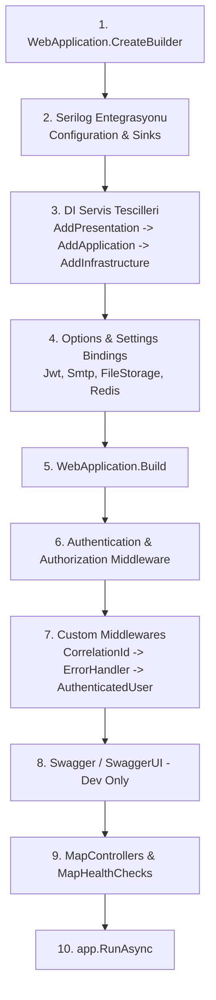
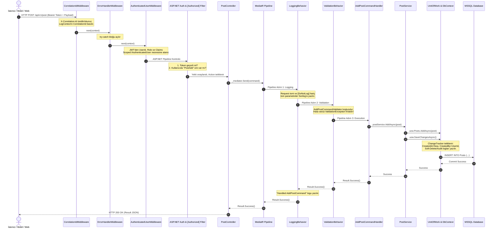
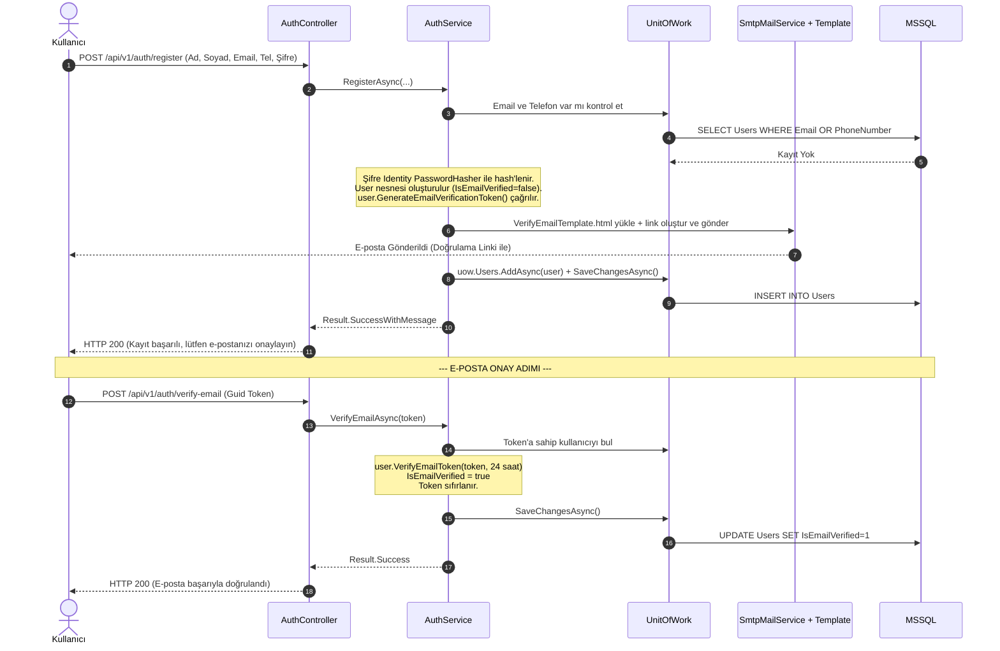
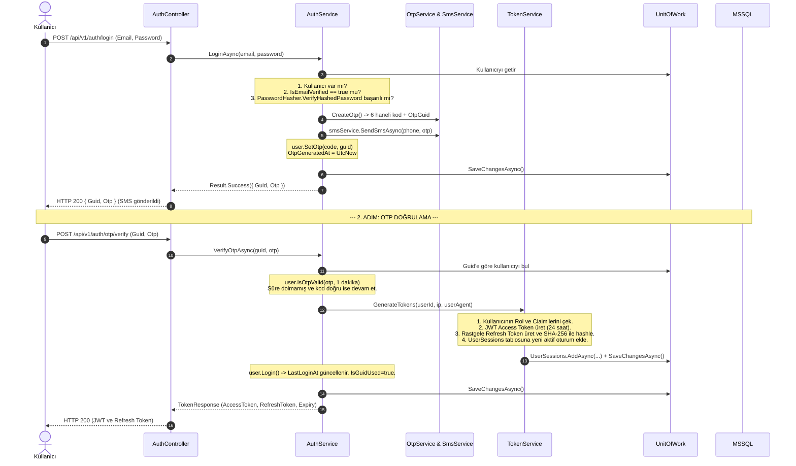
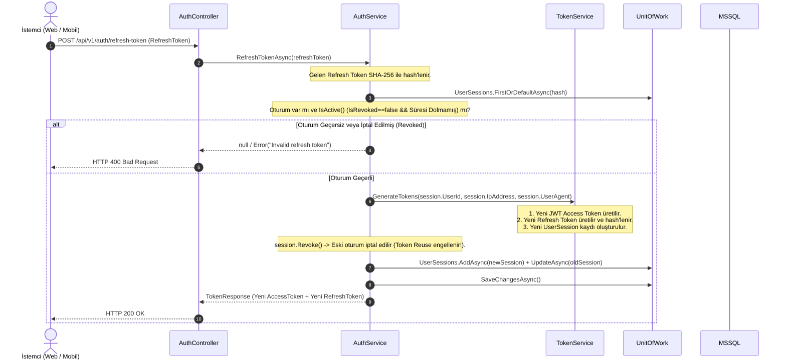
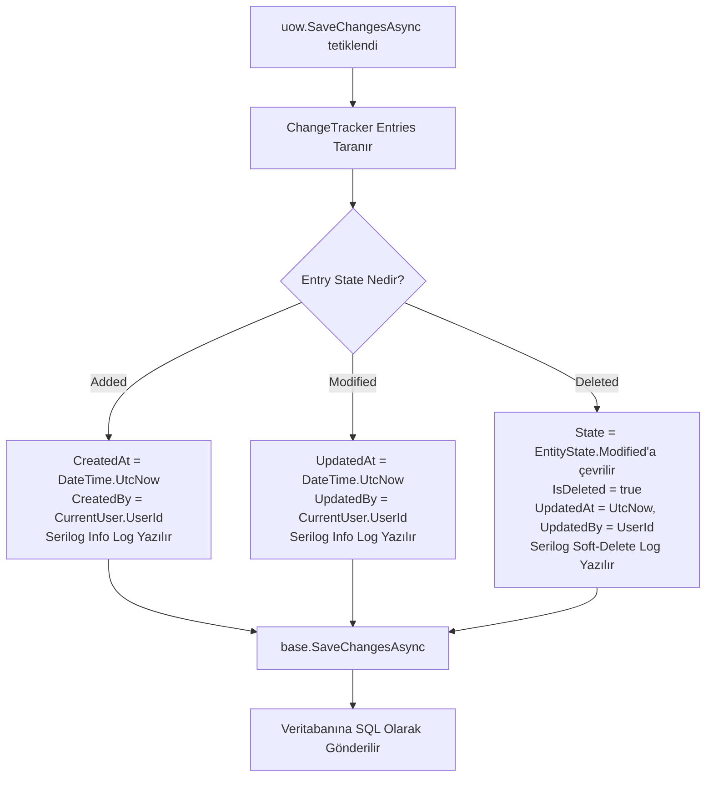
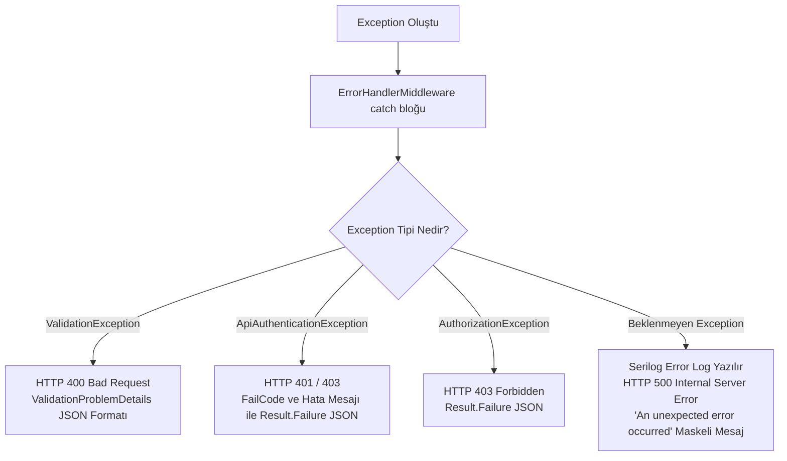

# 03. Sistem Yaşam Döngüsü ve Çalışma Sıraları (Lifecycles & Execution Flow) 🔄

DailyDN projesindeki isteklerin, kimlik doğrulama süreçlerinin, MediatR boru hattının ve hata yönetiminin hangi sıra ile çalıştığını bilmek, sistemin davranışını öngörmek ve hata ayıklamak (debug) için kritiktir.

Bu dokümanda sistemin tüm kritik çalışma sıraları ve akış diyagramları adım adım açıklanmıştır.

---

## 1. 🚀 Uygulama Başlatma (Application Boot / Startup) Sırası

Uygulama `Program.cs` üzerinden ayağa kalkarken aşağıdaki sıra ile yapılandırılır:

1. **Host & Serilog Kurulumu:** Serilog yapılandırması `appsettings.json`'dan okunur, Console, File ve Graylog UDP sink'leri aktif edilir.
2. **DI Servis Tescilleri:**
   - `AddPresentation()`: API versiyonlama, MediatR, JWT Bearer yetkilendirme şeması, DbContext, SignalR hub token okuyucu.
   - `AddApplication()`: AutoMapper profilleri, FluentValidation validator'ları, Domain servisleri (`AuthService`, `UserService`, `PostService`, `OtpService`), PasswordHasher.
   - `AddInfrastructure()`: Repository'ler, `UnitOfWork`, `TokenService`, `RedisCacheService`, `Polly AsyncPolicy`, `SmtpMailService`, `FileStorageService`, `FakeSmsProvider`.
3. **Konfigürasyon Bağlamaları (Options Pattern):** `JwtSettings`, `SmtpSettings`, `FileStorageSettings`, `RedisSettings` IOptions arayüzleri ile eşlenir.
4. **HTTP Pipeline Yapılandırması:** Middleware'ler tescil sırasına göre zincire eklenir.

---

## 2. 🌐 Uçtan Uca HTTP İstek Yaşam Döngüsü (Request Lifecycle)

İstemciden gelen korumalı bir HTTP POST isteğinin (örneğin `/api/v1/post` - `AddPostCommand`) sistem içerisindeki tam yolculuğu:

---

## 3. 🔐 Kimlik Doğrulama ve Güvenlik Akış Sıraları

### A. Kullanıcı Kaydı ve E-posta Doğrulama (Register & Email Verification)

---

### B. İki Adımlı Giriş (2FA) ve SMS OTP Akışı (Login & Verify OTP)

---

### C. Güvenli Token Rotasyonu (Refresh Token Rotation Flow)

---

## 4. 🗃️ Veritabanı Kayıt ve Denetim (Audit & Soft-Delete) Sırası

Herhangi bir servis veya handler `uow.SaveChangesAsync()` çağırdığında `ApplicationContext` içinde çalışan mekanizma:

---

## 5. ⚠️ Hata Yakalama ve Yanıt Dönüşüm Sırası (Error Handling)

Uygulamanın herhangi bir yerinde hata fırlatıldığında `ErrorHandlerMiddleware` tarafından devreye giren sıralama:

