# 04. Yeni Sistem ve Özellik Ekleme Rehberi (How to Add a New Feature) 🚀

Bu kılavuz, DailyDN mimarisinde uçtan uca yeni bir modül, entity, iş senaryosu (Use-Case / Feature), API endpoint'i ve birim testi eklemek isteyen geliştiriciler için **adım adım standart bir şablon (Blueprint)** sunar.

> **Örnek Senaryo:** Sisteme kullanıcıların postlara yorum yapabilmesini sağlayan bir **"Comment (Yorum)"** modülü eklediğimizi varsayalım.

---

## 📋 Geliştirme Adımları Özeti

```mermaid
graph LR
    D[1. Domain Entity] --> I1[2. EF Configuration & Context]
    I1 --> I2[3. Migration & DB Update]
    I2 --> I3[4. Repository & UnitOfWork]
    I3 --> A1[5. Application Service]
    A1 --> A2[6. CQRS Feature: Command/Query]
    A2 --> A3[7. Validator & Mapper]
    A3 --> P[8. API Controller]
    P --> S[9. Seed Claim / Permission]
    S --> T[10. Unit Tests]
```



---

## 🛠️ Adım Adım Uygulama Rehberi

### Adım 1: Domain Katmanında Entity Oluşturma (`DailyDN.Domain`)

Tüm varlıklar `DailyDN.Domain.Entities.Entity` temel sınıfından türetilmelidir.

📍 **Dosya:** `src/DailyDN.Domain/Entities/Comment.cs`
```csharp
namespace DailyDN.Domain.Entities
{
    public class Comment : Entity
    {
        public string Text { get; private set; } = null!;
        public int PostId { get; private set; }
        public Post Post { get; private set; } = null!;
        public int UserId { get; private set; }
        public User User { get; private set; } = null!;

        private Comment() { } // EF Core için boş constructor

        public Comment(string text, int postId, int userId)
        {
            Text = text;
            PostId = postId;
            UserId = userId;
        }

        public void UpdateText(string newText)
        {
            Text = newText;
        }
    }
}
```

---

### Adım 2: EF Core Konfigürasyonu ve DbContext Tescili (`DailyDN.Infrastructure`)

📍 **Dosya:** `src/DailyDN.Infrastructure/Configurations/CommentConfiguration.cs`
```csharp
using DailyDN.Domain.Entities;
using Microsoft.EntityFrameworkCore;
using Microsoft.EntityFrameworkCore.Metadata.Builders;

namespace DailyDN.Infrastructure.Configurations
{
    public class CommentConfiguration : IEntityTypeConfiguration<Comment>
    {
        public void Configure(EntityTypeBuilder<Comment> builder)
        {
            builder.ToTable("Comments");
            builder.HasKey(c => c.Id);

            builder.Property(c => c.Text)
                .IsRequired()
                .HasMaxLength(1000);

            builder.HasOne(c => c.Post)
                .WithMany()
                .HasForeignKey(c => c.PostId)
                .OnDelete(DeleteBehavior.Cascade);

            builder.HasOne(c => c.User)
                .WithMany()
                .HasForeignKey(c => c.UserId)
                .OnDelete(DeleteBehavior.Restrict);
        }
    }
}
```

📍 **Dosya:** `src/DailyDN.Infrastructure/Contexts/DailyDNDbContext.cs` içine DbSet ve Global Filter ekleyin:
```csharp
public DbSet<Comment> Comments { get; set; }

protected override void OnModelCreating(ModelBuilder modelBuilder)
{
    base.OnModelCreating(modelBuilder);
    // ...
    ApplyGlobalFilters<Comment>(modelBuilder); // Otomatik Soft-Delete filtresi!
}
```

---

### Adım 3: Migration Oluşturma ve Veritabanına Basma

Terminalden `src/DailyDN.API` dizininde aşağıdaki komutları çalıştırın:

```powershell
dotnet ef migrations add AddCommentEntity --project ../DailyDN.Infrastructure --startup-project .
dotnet ef database update --project ../DailyDN.Infrastructure --startup-project .
```

---

### Adım 4: Repository ve Unit of Work Entegrasyonu (`DailyDN.Infrastructure`)

Özel bir sorguya ihtiyaç varsa:

📍 **Interface:** `src/DailyDN.Infrastructure/Repositories/ICommentRepository.cs`
```csharp
using DailyDN.Domain.Entities;

namespace DailyDN.Infrastructure.Repositories
{
    public interface ICommentRepository : IGenericRepository<Comment>
    {
        Task<IReadOnlyList<Comment>> GetCommentsByPostIdAsync(int postId);
    }
}
```

📍 **Implementasyon:** `src/DailyDN.Infrastructure/Repositories/Impl/CommentRepository.cs`
```csharp
using DailyDN.Domain.Entities;
using DailyDN.Infrastructure.Contexts;
using Microsoft.EntityFrameworkCore;

namespace DailyDN.Infrastructure.Repositories.Impl
{
    public class CommentRepository(DailyDNDbContext context) : GenericRepository<Comment>(context), ICommentRepository
    {
        public async Task<IReadOnlyList<Comment>> GetCommentsByPostIdAsync(int postId)
        {
            return await Context.Comments
                .Include(c => c.User)
                .Where(c => c.PostId == postId)
                .OrderByDescending(c => c.CreatedAt)
                .ToListAsync();
        }
    }
}
```

📍 **UnitOfWork:** `IUnitOfWork` ve `UnitOfWork` içine `ICommentRepository Comments` özelliğini ekleyin ve `ServiceCollectionExtensions.cs` içine tescil edin.

---

### Adım 5: Application Domain Servisi (`DailyDN.Application`)

📍 **Interface:** `src/DailyDN.Application/Services/Interfaces/ICommentService.cs`
```csharp
using DailyDN.Domain.Entities;

namespace DailyDN.Application.Services.Interfaces
{
    public interface ICommentService
    {
        Task<Comment> AddCommentAsync(int postId, string text, CancellationToken cancellationToken);
    }
}
```

📍 **Implementasyon:** `src/DailyDN.Application/Services/Implementations/CommentService.cs`
```csharp
using DailyDN.Application.Services.Interfaces;
using DailyDN.Domain.Entities;
using DailyDN.Infrastructure.Services;
using DailyDN.Infrastructure.UnitOfWork;

namespace DailyDN.Application.Services.Implementations
{
    public class CommentService(IUnitOfWork uow, IAuthenticatedUser currentUser) : ICommentService
    {
        public async Task<Comment> AddCommentAsync(int postId, string text, CancellationToken cancellationToken)
        {
            var comment = new Comment(text, postId, currentUser.UserId);
            await uow.Comments.AddAsync(comment, cancellationToken);
            await uow.SaveChangesAsync();
            return comment;
        }
    }
}
```
> **Not:** `DailyDN.Application/ServiceCollectionExtensions.cs` içine `services.AddScoped<ICommentService, CommentService>();` kaydını yapmayı unutmayın.

---

### Adım 6: CQRS Dikey Dilimleme (Features) Ekleme (`DailyDN.Application`)

Dizin yapısı: `src/DailyDN.Application/Features/Comments/Add/`

1. 📨 **Command Modeli (`AddCommentCommand.cs`):**
```csharp
using DailyDN.Application.Messaging;

namespace DailyDN.Application.Features.Comments.Add
{
    public record AddCommentCommand(int PostId, string Text) : ICommand<int>;
}
```

2. 🛡️ **Validator Modeli (`AddCommentCommandValidator.cs`):**
```csharp
using FluentValidation;

namespace DailyDN.Application.Features.Comments.Add
{
    public class AddCommentCommandValidator : AbstractValidator<AddCommentCommand>
    {
        public AddCommentCommandValidator()
        {
            RuleFor(x => x.PostId).GreaterThan(0).WithMessage("Geçersiz Post ID.");
            RuleFor(x => x.Text)
                .NotEmpty().WithMessage("Yorum boş bırakılamaz.")
                .MaximumLength(1000).WithMessage("Yorum en fazla 1000 karakter olabilir.");
        }
    }
}
```

3. ⚙️ **Handler Modeli (`AddCommentCommandHandler.cs`):**
```csharp
using DailyDN.Application.Common.Model;
using DailyDN.Application.Messaging;
using DailyDN.Application.Services.Interfaces;

namespace DailyDN.Application.Features.Comments.Add
{
    public class AddCommentCommandHandler(ICommentService commentService) : ICommandHandler<AddCommentCommand, int>
    {
        public async Task<Result<int>> Handle(AddCommentCommand request, CancellationToken cancellationToken)
        {
            var comment = await commentService.AddCommentAsync(request.PostId, request.Text, cancellationToken);
            return Result.Success(comment.Id);
        }
    }
}
```

---

### Adım 7: AutoMapper Profili (`DailyDN.Application/Profiles/MappingProfile.cs`)

Gerekiyorsa DTO ve Response nesneleri arasındaki eşlemeleri ekleyin:
```csharp
CreateMap<Comment, CommentResponse>()
    .ForMember(dest => dest.UserName, opt => opt.MapFrom(src => src.User.FullName));
```

---

### Adım 8: API Controller Endpoint'i Oluşturma (`DailyDN.API`)

📍 **Dosya:** `src/DailyDN.API/Controllers/CommentController.cs`
```csharp
using DailyDN.Application.Common.Attributes;
using DailyDN.Application.Common.Model;
using DailyDN.Application.Features.Comments.Add;
using MediatR;
using Microsoft.AspNetCore.Authorization;
using Microsoft.AspNetCore.Mvc;

namespace DailyDN.API.Controllers
{
    [ApiVersion("1.0")]
    [ApiController]
    [Route("api/v{version:apiVersion}/[controller]")]
    [Authorize]
    public class CommentController(IMediator _mediator) : ControllerBase
    {
        [HttpPost]
        [MapToApiVersion("1.0")]
        [Authorized("CommentAdd")] // Özel claim yetki kontrolü
        [ProducesResponseType(StatusCodes.Status200OK, Type = typeof(Result<int>))]
        [ProducesResponseType(StatusCodes.Status400BadRequest, Type = typeof(Result))]
        public async Task<IActionResult> Add([FromBody] AddCommentCommand command)
        {
            var result = await _mediator.Send(command);
            return result.IsSuccess ? Ok(result) : BadRequest(result);
        }
    }
}
```

---

### Adım 9: Seed Yetki / Claim Tanımlama (`DailyDN.Infrastructure/Seed/`)

Eğer endpoint için özel bir claim (`CommentAdd`) gerekiyorsa:
1. `ClaimSeed.cs` içine yeni claim ekleyin (`Id: 7, Type: "Permissions", Value: "CommentAdd"`).
2. `RoleClaimSeed.cs` içine bu izni `User` ve `Admin` rollerine bağlayın.

---

### Adım 10: Unit Test Yazımı (`DailyDN.Tests`)

📍 **Dosya:** `src/DailyDN.Tests/Application/Features/Comments/AddCommentCommandHandlerTests.cs`
```csharp
using DailyDN.Application.Features.Comments.Add;
using DailyDN.Application.Services.Interfaces;
using DailyDN.Domain.Entities;
using FluentAssertions;
using Moq;
using Xunit;

namespace DailyDN.Tests.Application.Features.Comments
{
    public class AddCommentCommandHandlerTests
    {
        private readonly Mock<ICommentService> _commentServiceMock;
        private readonly AddCommentCommandHandler _handler;

        public AddCommentCommandHandlerTests()
        {
            _commentServiceMock = new Mock<ICommentService>();
            _handler = new AddCommentCommandHandler(_commentServiceMock.Object);
        }

        [Fact]
        public async Task Handle_Should_ReturnSuccess_WhenCommentAdded()
        {
            // Arrange
            var command = new AddCommentCommand(1, "Harika bir yazı!");
            var comment = new Comment("Harika bir yazı!", 1, 5) { Id = 10 };

            _commentServiceMock
                .Setup(s => s.AddCommentAsync(command.PostId, command.Text, It.IsAny<CancellationToken>()))
                .ReturnsAsync(comment);

            // Act
            var result = await _handler.Handle(command, CancellationToken.None);

            // Assert
            result.IsSuccess.Should().BeTrue();
            result.Data.Should().Be(10);
            _commentServiceMock.Verify(s => s.AddCommentAsync(1, "Harika bir yazı!", It.IsAny<CancellationToken>()), Times.Once);
        }
    }
}
```
