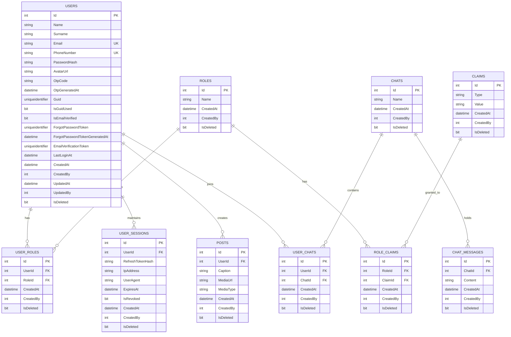

# 05. Veri Modeli ve Veritabanı Mimarisi (Data Model & Database) 💾

DailyDN veritabanı mimarisi, ilişkisel veri bütünlüğünü (relational integrity) koruyan, otomatik denetim izleri (Audit Logging) tutan ve verilerin fiziksel olarak silinmesini engelleyen (Soft Delete) kurumsal bir EF Core yapısına sahiptir.

---

## 🗄️ Varlık İlişki Diyagramı (ER Diagram)



---

## 🏛️ Temel Varlık Yapısı (`Entity.cs`)

Projedeki istisnasız tüm veritabanı entity'leri `DailyDN.Domain.Entities.Entity` sınıfından türer.

| Alan Adı | Tip | Açıklama |
|---|---|---|
| `Id` | `int` | Birincil Anahtar (Primary Key, Identity/Auto-Increment). |
| `CreatedAt` | `DateTime` | Kaydın oluşturulduğu UTC zaman damgası (Default: `GETDATE()`). |
| `CreatedBy` | `int` | Kaydı oluşturan kullanıcının ID'si (`0` veya giriş yapmış User ID). |
| `UpdatedAt` | `DateTime?` | Kaydın son güncellendiği UTC zaman damgası (Default: `null`). |
| `UpdatedBy` | `int?` | Kaydı son güncelleyen kullanıcının ID'si. |
| `IsDeleted` | `bool` | Yumuşak silme bayrağı (Default: `false`). |

---

## 🕵️ Otomatik Audit Logging ve Soft-Delete Mekanizması

Veritabanına yapılan tüm kayıt, güncelleme ve silme işlemleri `ApplicationContext.ApplyAuditInfo()` metodu ile otomatik olarak yönetilir:

```csharp
private void ApplyAuditInfo()
{
    var entries = ChangeTracker.Entries()
        .Where(e => e.Entity is Entity && (
            e.State == EntityState.Added ||
            e.State == EntityState.Modified ||
            (e.State == EntityState.Deleted && e.Entity is Entity)));

    foreach (var entityEntry in entries)
    {
        if (entityEntry.Entity is Entity entity)
        {
            if (entityEntry.State == EntityState.Added)
            {
                entity.CreatedAt = DateTime.UtcNow;
                entity.CreatedBy = _currentUser;
                _logger.LogInformation("Entity of type {EntityType} with ID {EntityId} created by {User}",
                    entity.GetType().Name, entity.Id, _currentUser);
            }
            else if (entityEntry.State == EntityState.Modified)
            {
                entity.UpdatedAt = DateTime.UtcNow;
                entity.UpdatedBy = _currentUser;
                _logger.LogInformation("Entity of type {EntityType} with ID {EntityId} updated by {User}",
                    entity.GetType().Name, entity.Id, _currentUser);
            }
            else if (entityEntry.State == EntityState.Deleted)
            {
                // Soft delete: Fiziksel silme engellenir!
                entityEntry.State = EntityState.Modified;
                entity.IsDeleted = true;
                entity.UpdatedAt = DateTime.UtcNow;
                entity.UpdatedBy = _currentUser;
                _logger.LogInformation("Entity of type {EntityType} with ID {EntityId} soft-deleted by {User}",
                    entity.GetType().Name, entity.Id, _currentUser);
            }
        }
    }
}
```

---

## 🔍 Global Query Filter (Yumuşak Silinen Verilerin Otomatik Filtrelenmesi)

`DailyDNDbContext.OnModelCreating()` içerisinde her varlık için:
```csharp
protected static void ApplyGlobalFilters<T>(ModelBuilder builder) where T : Entity
{
    builder.Entity<T>().HasQueryFilter(e => !e.IsDeleted);
}
```
tanımlanmıştır. Bu sayede yazılan tüm LINQ sorgularında (`_context.Users.ToListAsync()`, `FirstOrDefaultAsync` vb.) EF Core arka planda otomatik olarak `WHERE IsDeleted = 0` şartını ekler.

> **İpucu:** Silinmiş kayıtları da okumak gereken özel raporlama durumlarında `.IgnoreQueryFilters()` metodu kullanılabilir.

---

## 🌱 Başlangıç Tohum Verileri (Seed Data)

Uygulama ayağa kalktığında `Infrastructure/Seed/` altındaki konfigürasyonlarla şu veriler otomatik yüklenir:

### 1. Roller (`RoleSeed.cs`)
- `Id: 1` -> **Admin**
- `Id: 2` -> **User**

### 2. İzinler / Claim'ler (`ClaimSeed.cs`)
- `Id: 1` -> `Type: "Permissions"`, `Value: "UserGet"`
- `Id: 2` -> `Type: "Permissions"`, `Value: "UserAdd"`
- `Id: 3` -> `Type: "Permissions"`, `Value: "UserUpdate"`
- `Id: 4` -> `Type: "Permissions"`, `Value: "UserDelete"`
- `Id: 5` -> `Type: "Permissions"`, `Value: "PostGet"`
- `Id: 6` -> `Type: "Permissions"`, `Value: "PostAdd"`

### 3. Rol - Yetki Eşleştirmeleri (`RoleClaimSeed.cs`)
- **Admin Rolü:** Tüm yetkilere (`UserGet`, `UserAdd`, `UserUpdate`, `UserDelete`, `PostGet`, `PostAdd`) sahiptir.
- **User Rolü:** Standart yetkilere (`PostGet`, `PostAdd`) sahiptir.

### 4. Varsayılan Kullanıcılar (`UserSeed.cs`)
- **Admin:** `admin@example.com` (Şifre: PBKDF2 hashlenmiş, EmailVerified: `true`, Rol: `Admin`).
- **Test User:** `user@example.com` (Şifre: PBKDF2 hashlenmiş, EmailVerified: `true`, Rol: `User`).
