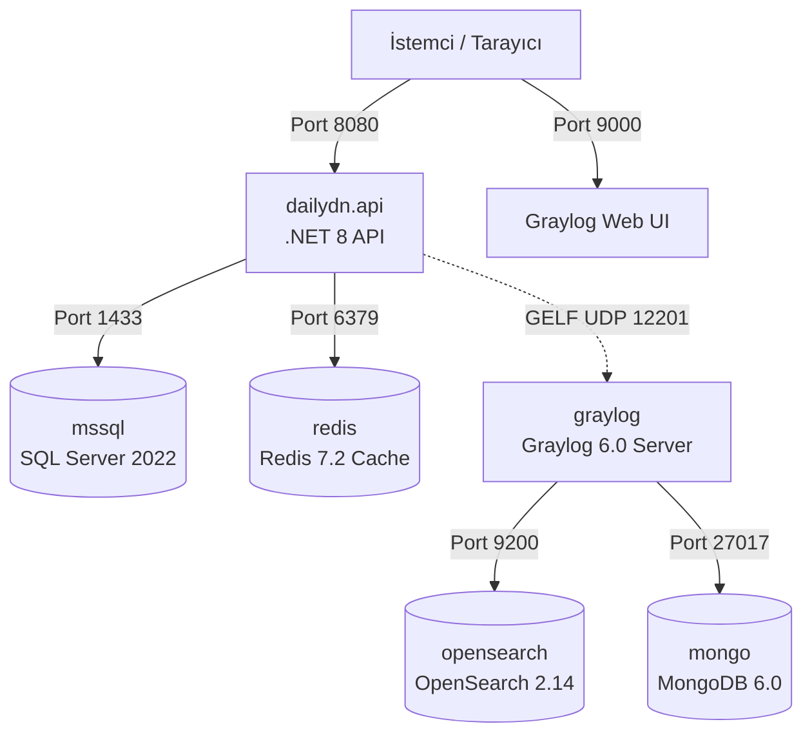

# 06. Altyapı, Docker ve DevOps Mimarisi (Infrastructure & DevOps) 🐳

DailyDN projesi, modern mikroservis ve bulut mimarilerine hazır olacak şekilde kapsayıcılaştırılmış (containerized) ve tüm altyapı bağımlılıkları **Docker Compose** ile tek bir komutla ayağa kalkacak şekilde tasarlanmıştır.

---

## 🏗️ Docker Compose Servis Topolojisi

`docker-compose.yml` dosyası aşağıdaki 6 ana servisi ve bunların kalıcı disk birimlerini (volumes) yönetir:



---

## 📦 Servis Detayları ve Port Haritası

| Servis Adı | İmaj (Image) | Host Portu | Container Portu | Açıklama |
|---|---|---|---|---|
| `dailydn.api` | `Dockerfile` (Multi-stage build) | **8080** | 8080 | ASP.NET Core Web API uygulaması |
| `mssql` | `mcr.microsoft.com/mssql/server:2022-latest` | **1433** | 1433 | Ana ilişkisel veritabanı (MSSQL) |
| `redis` | `redis:7.2` | **6379** | 6379 | Önbellek, Oturum ve State yönetimi |
| `graylog` | `graylog/graylog:6.0` | **9000** (UI), **12201** (GELF) | 9000 (HTTP), 12201 (UDP/TCP) | Merkezi log toplama ve yönetim platformu |
| `opensearch` | `opensearchproject/opensearch:2.14.0` | **9200**, **9600** | 9200, 9600 | Graylog log indeksleme ve arama motoru |
| `mongo` | `mongo:6.0` | **27017** | 27017 | Graylog metadata ve kullanıcı ayarları veritabanı |

---

## 🔑 Ortam Değişkenleri (`.env`)

Uygulamanın çalışması için proje kök dizininde bir `.env` dosyası oluşturulmalıdır. `.env.example` dosyasındaki alanların açıklamaları:

```ini
# VERİTABANI (MSSQL)
MSSQL_SA_PASSWORD=SuperStrongPassword123!

# OPENSEARCH (Graylog için)
OPENSEARCH_INITIAL_ADMIN_PASSWORD=SuperStrongAdmin123!

# REDIS BAĞLANTISI
REDIS_CONNECTION=redis:6379,abortConnect=false

# MONGODB (Graylog için)
MONGO_CONNECTION=mongodb://mongo:27017
MONGO_DB_NAME=DailyDN

# SMTP E-POSTA AYARLARI
SMTP_HOST=smtp.gmail.com
SMTP_PORT=587
SMTP_USER=ornek-hesap@gmail.com
SMTP_PASSWORD=uygulama-sifresi-buraya
SMTP_SSL=true
```

---

## ⚙️ Uygulama Konfigürasyonu (`appsettings.json`)

`appsettings.Development.json` ve diğer ortam dosyaları hiyerarşik yapılandırmayı yönetir:

### 1. Serilog Yapılandırması
Loglar aynı anda üç hedefe (Sink) yönlendirilir:
- **Console:** Anlık geliştirici çıktıları.
- **File (`Logs/log-.txt`):** Günlük rotasyonlu metin dosyaları.
- **Graylog (GELF UDP `localhost:12201`):** Merkezi izleme.

### 2. JWT Ayarları (`JwtSettings`)
```json
"JwtSettings": {
  "Issuer": "DailyDN",
  "Audience": "DailyDNUsers",
  "Key": "aS3cR3tK3yTh4tIsAtL34st32CharsLong!",
  "ExpiresInMinutes": 1440,
  "RefreshTokenExpiresInDays": 7
}
```

### 3. Dosya Depolama Ayarları (`FileStorage`)
```json
"FileStorage": {
  "BasePath": "C:/DailyDNFileStorage",
  "BaseUrl": "http://localhost:5000/files"
}
```

---

## 🚀 Sistemi Çalıştırma Komutları

### 1. Tüm Sistemi Docker ile Başlatma
```powershell
# Arka planda tüm container'ları derle ve başlat
docker compose up -d --build

# Container loglarını canlı izle
docker compose logs -f dailydn.api
```

### 2. Sadece Bağımlılıkları (MSSQL, Redis, Graylog) Başlatma, API'yi Yerelde Çalıştırma
Geliştirme yaparken API'yi Visual Studio / VS Code üzerinden debug etmek için:
```powershell
# Altyapı servislerini başlat
docker compose up -d mssql redis mongo opensearch graylog

# API projesini yerelde çalıştır
dotnet run --project src/DailyDN.API
```

### 3. Graylog Web Paneline Giriş
1. Tarayıcınızda `http://localhost:9000` adresine gidin.
2. Kullanıcı Adı: `admin`
3. Şifre: `admin` (veya compose dosyasındaki SHA2 hash karşılığı).
4. `System -> Inputs` menüsünden **GELF UDP (Port 12201)** input'unun çalıştığını doğrulayın.
