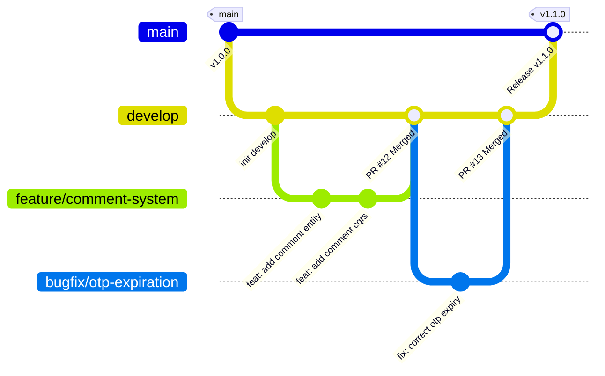
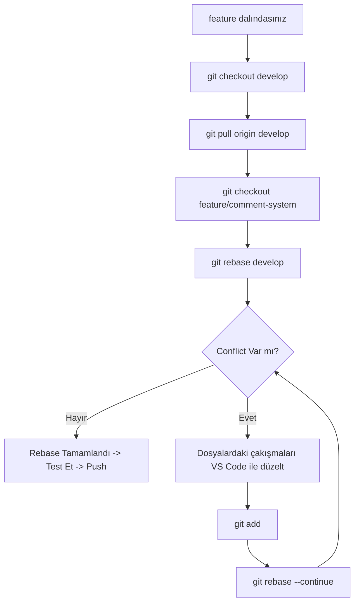

# 08. Git İş Akışı ve Geliştirme Rehberi (Git Workflow & Contribution Guide) 🐙

Bu rehber, **DailyDN** projesinde arkadaşınızla birlikte çalışırken kod kalitesini korumak, çakışmaları (conflicts) önlemek, temiz bir commit geçmişi oluşturmak ve güvenli bir Pull Request (PR) kültürü yürütmek için hazırlanmış **standart Git iş akışıdır**.

---

## 🧭 Altın Kurallar (Golden Rules)

1. 🚫 **Doğrudan `main` veya `develop` branch'lerine ASLA `git push` yapmayın.** Tüm geliştirmeler amaca özel açılan dal (branch) üzerinden yürütülür.
2. 🔄 **Geliştirmeye başlamadan önce DAİMA güncel kodu çekin (`git pull`).**
3. 🧪 **Commit atmadan ve PR açmadan önce projeyi mutlaka derleyin (`dotnet build`) ve testleri çalıştırın (`dotnet test`).**
4. 🔐 **Gerçek şifreleri, API anahtarlarını veya `.env` dosyalarını ASLA commit'lemeyin.**
5. ✍️ **Commit mesajlarını [Conventional Commits](https://www.conventionalcommits.org/) standardına uygun yazın.**

---

## 🌿 1. Dal (Branch) Stratejisi ve İsimlendirme Kuralları



### Dal Türleri ve Formatları:

| Dal Tipi | Format | Örnek | Açıklama |
|---|---|---|---|
| **Ana Sürüm** | `main` | `main` | Canlıya (Production) çıkan, her an kararlı ve test edilmiş kod. |
| **Entegrasyon** | `develop` | `develop` | Geliştiricilerin özelliklerini birleştirdiği ana geliştirme dalı. |
| **Toplu Bugfix**| `bugfix/core-fixes` | `bugfix/core-fixes` | Her bug için ayrı branch açmak yerine, sırayla commit atılan ortak hata düzeltme dalı. |
| **Yeni Özellik** | `feature/<özellik-adı>` | `feature/comment-system` | Yeni bir modül veya büyük özellik geliştirilirken. |
| **Acil Yama** | `hotfix/<hata-adı>` | `hotfix/security-jwt-leak` | `main` dalında canlıda çıkan kritik bir hatayı çözerken. |
| **İyileştirme** | `refactor/<konu>` | `refactor/redis-cache-service` | Davranış değiştirmeden kod temizliği/optimizasyon yaparken. |
| **Dokümantasyon**| `docs/<konu>` | `docs/add-api-guide` | Yalnızca döküman eklerken/güncellerken. |

---

## 🚀 2. Günlük Geliştirme Döngüsü (Adım Adım)

### Adım 1: `develop` Dalını Güncelleyin
Her gün veya yeni bir işe başlamadan önce:
```powershell
# develop dalına geçin
git checkout develop

# Uzak sunucudaki (GitHub/GitLab) en son değişiklikleri çekin
git pull origin develop
```

### Adım 2: Yeni Bir Feature Dalı Açın
```powershell
# develop dalından yeni bir dal türetip ona geçin
git checkout -b feature/comment-system
```

### Adım 3: Kodunuzu Yazın ve Test Edin
Geliştirmenizi tamamladıktan sonra projenin derlendiğinden ve testlerin geçtiğinden emin olun:
```powershell
# Projeyi derleyin
dotnet build

# Testleri çalıştırın
dotnet test
```

### Adım 4: Değişiklikleri İnceleyin (Diff & Status)
Neleri değiştirdiğinizi commit atmadan önce mutlaka gözden geçirin:
```powershell
# Değişen ve yeni eklenen dosyaları listele
git status

# Yapılan satır bazlı değişiklikleri incele
git diff
```

### Adım 5: Değişiklikleri Sahneye Alın (Stage)
İlgisiz geçici dosyaları veya IDE ayarlarını eklememek için dosyaları seçerek ekleyin:
```powershell
# Belirli dosyaları eklemek (Tavsiye edilen)
git add src/DailyDN.Domain/Entities/Comment.cs
git add src/DailyDN.Application/Features/Comments/

# Veya tüm projeyi eklemek
git add .
```

### Adım 6: Anlamlı Bir Commit Mesajı ile Kaydedin
```powershell
git commit -m "feat(comment): add comment entity and CQRS handlers"
```

### Adım 7: Dalınızı Uzak Sunucuya Push Edin
```powershell
# İlk defa push ederken -u bayrağı ile upstream tanımlayın:
git push -u origin feature/comment-system
```

---

## 📝 3. Commit Mesaj Standartları (Conventional Commits)

Commit mesajları projenin hafızasıdır. Mesajlarınızı aşağıdaki standartta yazın:

```
<tip>(<kapsam>): <kısa ve net açıklama>
```

### Desteklenen Tipler (`Type`):
- `feat`: Yeni bir özellik eklendiğinde (`feat(auth): add google login support`).
- `fix`: Bir hata düzeltildiğinde (`fix(user): correct user repository query filter`).
- `refactor`: Kod yapısı iyileştirildiğinde, temizlendiğinde (`refactor(redis): optimize cache key generation`).
- `perf`: Performans artışı sağlayan değişikliklerde (`perf(db): add index to user email column`).
- `test`: Yeni test eklendiğinde veya mevcut testler güncellendiğinde (`test(auth): add unit tests for login command`).
- `docs`: Sadece dokümantasyon değişikliğinde (`docs: add git workflow guide`).
- `chore`: Paket güncellemesi, build ayarı, `.gitignore` düzenlemesi (`chore: update packages to net8.0.8`).

### ✅ İyi ve ❌ Kötü Commit Örnekleri:

| ❌ Kötü Örnek | ✅ İyi Örnek |
|---|---|
| `güncelleme yapıldı` | `feat(post): add pagination support to post list query` |
| `hata düzeltildi` | `fix(jwt): resolve token expiration calculation bug` |
| `kodlar temizlendi` | `refactor(repository): clean generic repository async methods` |
| `asdasd / test` | `test(user): add unit tests for update profile photo command` |

---

## 🔀 4. Çakışmaları Çözme (Rebase & Conflict Resolution)

Siz `feature/comment-system` üzerinde çalışırken arkadaşınız `develop` dalına yeni kodlar atmış olabilir. Kodunuzu güncellemek için **Rebase** yöntemi tercih edilir:



### Adım Adım Rebase Komutları:
```powershell
# 1. develop'u güncelleyin
git checkout develop
git pull origin develop

# 2. Feature dalınıza dönüp rebase yapın
git checkout feature/comment-system
git rebase develop

# 3. Eğer Conflict çıkarsa:
# Dosyaları açıp <<<<<< HEAD ve >>>>>> bloklarını düzenleyin.
git add .
git rebase --continue

# 4. Rebase sonrası uzak sunucuya push (Gerekirse --force-with-lease ile)
git push --force-with-lease origin feature/comment-system
```
> [!TIP]
> ASLA düz `--force` kullanmayın; daima başkalarının commit'ini ezmemek için `--force-with-lease` tercih edin.

---

## 🤝 5. Pull Request (PR) Açma ve Kod İnceleme (Code Review)

Geliştirmeniz bittiğinde GitHub veya GitLab üzerinden `develop` dalına doğru bir **Pull Request** açın.

### 📋 Örnek PR Açıklama Şablonu:

```markdown
## 📌 Yapılan Değişiklikler
- `Comment` entity'si ve EF Core konfigürasyonu eklendi.
- Yorum ekleme için `AddCommentCommand` ve FluentValidation kuralları yazıldı.
- `CommentController` üzerinden `POST /api/v1/comment` endpoint'i açıldı.
- Yetkilendirme için `CommentAdd` claim kontrolü eklendi.

## 🧪 Testler
- [x] Tüm birim testler başarıyla geçti (`dotnet test`).
- [x] Postman ile local ortamda test edildi.
- [x] Hata durumlarında ErrorHandlerMiddleware yanıtları doğrulandı.

## ⚠️ Dikkat Edilmesi Gerekenler
- Veritabanına yeni `Comments` tablosu eklenmesi için migration çalıştırılmalıdır (`dotnet ef database update`).
```

---

## 🧰 6. Sık Karşılaşılan Durumlar İçin Can Simidi Komutlar (Cheat Sheet)

### 1. Yarım Kalan İşi Geçici Olarak Saklama (`stash`)
Başka bir acil işe geçmeniz gerektiğinde ama commit atmak istemediğinizde:
```powershell
# Değişiklikleri geçici rafa kaldır
git stash save "yorum sistemi yarım kaldı"

# Başka dala geçip işinizi yapın...
git checkout develop

# Geri döndüğünüzde değişiklikleri geri yükleyin
git checkout feature/comment-system
git stash pop
```

### 2. Son Commit Mesajını veya Unutulan Dosyayı Düzeltme (`amend`)
```powershell
# Unuttuğunuz dosyayı ekleyin
git add src/DailyDN.API/Controllers/CommentController.cs

# Son commit'i bozmadan içine dahil edin / mesajı güncelleyin
git commit --amend --no-edit
```

### 3. Yanlışlıkla Değiştirilen Bir Dosyayı Sıfırlama
```powershell
# Dosyadaki yerel değişiklikleri geri al
git restore src/DailyDN.API/appsettings.Development.json
```

### 4. Son Commit'i Geri Alma Ama Kodları Kaybetmeme (`soft reset`)
```powershell
# Commit'i iptal eder, yazdığınız kodlar staged (yeşil) olarak kalır
git reset --soft HEAD~1
```

### 5. Grafiksel Log Geçmişini İnceleme
```powershell
git log --graph --oneline --decorate --all
```
