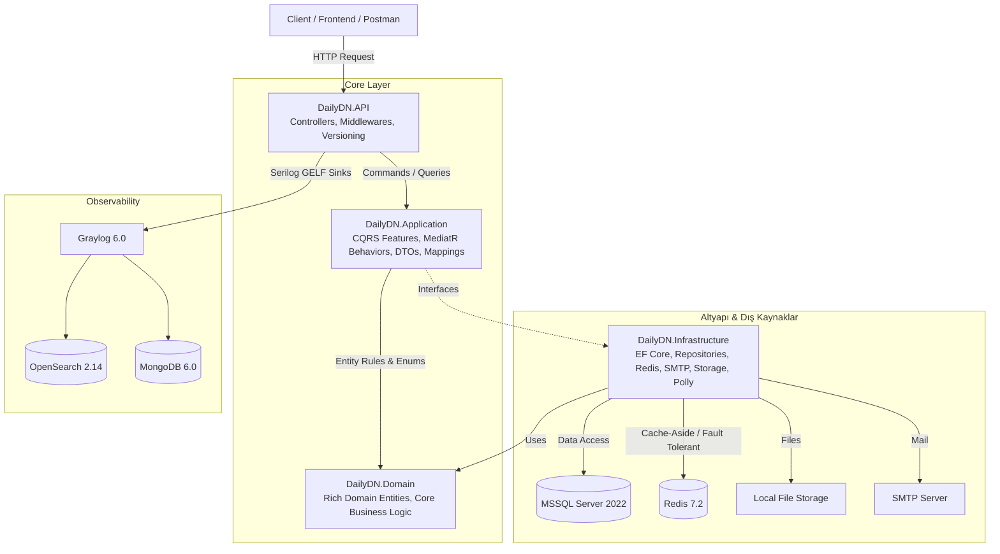

# DailyDN - Proje ve Mimari Dokümantasyonu 📚

**DailyDN**, modern kurumsal yazılım standartlarına (Clean Architecture, CQRS, Onion/Hexagonal prensipleri) uygun olarak geliştirilmiş; yüksek dayanıklılık, güvenlik, loglama ve performans odaklı bir **.NET 8 Web API** projesidir.

Bu dokümantasyon seti, projenin baştan sona tüm mimari katmanlarını, alt sistemlerini, yaşam döngülerini ve yeni özellik geliştirme standartlarını detaylandırmak üzere hazırlanmıştır.

---

## 🗂️ Dokümantasyon Rehberi & İndeks

Aşağıda proje kapsamında oluşturulan detaylı analiz ve rehber dokümanlarının listesi bulunmaktadır:

| No | Doküman Adı | Açıklama |
|---|---|---|
| 01 | [01. Katmanlı Mimari ve Sorumluluklar](file:///c:/Users/Kutbay/Desktop/Muhammed/DailyDN/Docs/01-architecture-and-layers.md) | `Domain`, `Application`, `Infrastructure`, `API` ve `Tests` katmanlarının görevleri, sınırları ve bağımlılık yönleri. |
| 02 | [02. Sistemler, Bileşenler ve Amaçları](file:///c:/Users/Kutbay/Desktop/Muhammed/DailyDN/Docs/02-systems-and-components.md) | Projede yer alan sistemlerin (Auth/JWT, Redis+Polly, Audit Log, Soft-Delete, SMTP, File Storage, Graylog, SMS) nerelerde ve ne amaçla kurulduğu. |
| 03 | [03. Sistem Yaşam Döngüsü ve Çalışma Sıraları](file:///c:/Users/Kutbay/Desktop/Muhammed/DailyDN/Docs/03-system-execution-and-lifecycles.md) | Uygulama açılış (Boot), HTTP Request/Response pipeline'ı, MediatR Pipeline davranışları, Login/OTP/Token rotasyonu ve hata yakalama sıralamaları. |
| 04 | [04. Yeni Sistem/Özellik Ekleme Rehberi](file:///c:/Users/Kutbay/Desktop/Muhammed/DailyDN/Docs/04-how-to-add-new-feature.md) | Projeye sıfırdan uçtan uca yeni bir modül/entity/feature/endpoint ve test ekleme adım adım blueprint rehberi. |
| 05 | [05. Veri Modeli, EF Core ve Veritabanı Mimarisi](file:///c:/Users/Kutbay/Desktop/Muhammed/DailyDN/Docs/05-data-model-and-database.md) | Entity ilişkileri, Generic Repository & Unit of Work, Audit/Soft Delete mekanizması, Seed verileri ve Migration stratejisi. |
| 06 | [06. Altyapı, Docker ve DevOps Mimarisi](file:///c:/Users/Kutbay/Desktop/Muhammed/DailyDN/Docs/06-infrastructure-and-devops.md) | `docker-compose.yml`, MSSQL, Redis, MongoDB, OpenSearch, Graylog, çevre değişkenleri (`.env`) ve ortam ayarları (`appsettings`). |
| 07 | [07. Güvenlik, Hata Yönetimi ve Best Practices](file:///c:/Users/Kutbay/Desktop/Muhammed/DailyDN/Docs/07-security-and-best-practices.md) | Claim-based Authorization, Password Hashing, Token Rotation, Circuit Breaker, `[DoNotLog]` hassas veri maskeleme ve kod kalitesi. |
| 08 | [08. Git İş Akışı ve Geliştirme Rehberi](file:///c:/Users/Kutbay/Desktop/Muhammed/DailyDN/Docs/08-git-workflow-and-contribution-guide.md) | Branch stratejisi (`develop`/`feature`), Conventional Commits standartları, Rebase/Conflict çözümü, PR şablonu ve Git cheat sheet. |
| 📋 | [Proje Backlog ve Görev Takibi (Backlog)](file:///c:/Users/Kutbay/Desktop/Muhammed/DailyDN/Docs/backlog/Backlog.md) | Tarih ve saat damgalı aktif, yarım kalan ve tamamlanan görevlerin bağlam kaybını önleyen kayıt defteri. |
| 🔬 | [Araştırma ve Kod Analiz Raporları (Researches)](file:///c:/Users/Kutbay/Desktop/Muhammed/DailyDN/Docs/researches/README.md) | Projenin statik kod analizi, kritik hatalar (bugs), güvenlik zafiyetleri, anti-pattern'ler ve refactoring incelemeleri. |

---

## 🏛️ Mimari Genel Bakış (High-Level Architecture)

---

## 💡 Temel Teknoloji Yığını

- **Dil / Platform:** C# 12 / .NET 8
- **Mimari:** Clean Architecture + CQRS + Repository & UnitOfWork Pattern
- **ORM / Veritabanı:** Entity Framework Core 8, Microsoft SQL Server 2022
- **Arabulucu (Mediator):** MediatR 12 (Pipeline Behaviors: Logging & Validation)
- **Doğrulama (Validation):** FluentValidation 11
- **Önbellek & Dayanıklılık:** StackExchange.Redis, Polly 8 (Retry + Circuit Breaker + Fallback Policy Wrap)
- **Kimlik Doğrulama & Yetkilendirme:** JWT (JSON Web Token), Refresh Token Rotation, Claim-Based Custom Authorization Filter (`[Authorized("ClaimName")]`)
- **Nesne Eşleme (Mapping):** AutoMapper 13
- **Loglama & İzleme:** Serilog, Serilog GELF Sink, CorrelationId Middleware, Graylog 6.0, OpenSearch 2.14, MongoDB 6.0
- **Test:** xUnit, Moq, FluentAssertions
- **Konteynerleştirme:** Docker & Docker Compose
